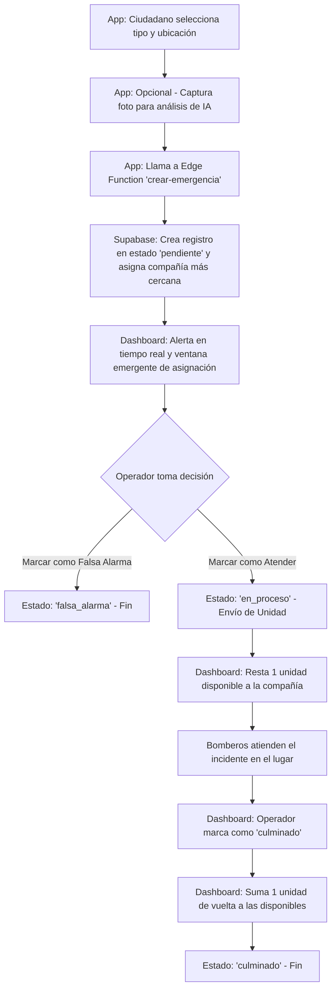

# OmniGuard Dashboard

Este es el panel web de administración de **OmniGuard**, desarrollado con Next.js y TypeScript. Permite a las centrales de bomberos y operadores de emergencia monitorear en tiempo real los incidentes reportados por los ciudadanos y gestionar la asignación de unidades de rescate.

---

## Despliegue Local

Sigue estos pasos para ejecutar la aplicación en tu entorno local:

### 1. Requisitos Previos
* **Node.js** (versión 18 o superior recomendada)
* **npm**, **yarn**, **pnpm** o **bun**

### 2. Instalar Dependencias
Instala los paquetes necesarios ejecutando el siguiente comando en la raíz del proyecto:
```bash
npm install
# o bien
yarn install
# o bien
pnpm install
```

### 3. Configuración de Variables de Entorno
Crea un archivo llamado `.env.local` en la raíz de `omniguard-dashboard` (este archivo está configurado en `.gitignore` para no ser subido al repositorio) y añade tus credenciales de Supabase:

```env
NEXT_PUBLIC_SUPABASE_URL=https://tu-proyecto.supabase.co
NEXT_PUBLIC_SUPABASE_ANON_KEY=tu-clave-anonima-publica
SUPABASE_SERVICE_ROLE_KEY=tu-clave-service-role-privada
```

### 4. Iniciar Servidor de Desarrollo
Inicia el entorno de desarrollo local con:
```bash
npm run dev
# o bien
yarn dev
# o bien
pnpm dev
```

Abre [http://localhost:3000](http://localhost:3000) en tu navegador para ver y probar el dashboard.

---

## 🔄 Flujo Completo de una Emergencia

El ciclo de vida de una emergencia conecta la aplicación móvil del ciudadano con el dashboard del operador de la central. A continuación se detalla este flujo:



### Detalle de los Pasos:

#### 1. Registro e IA en la App Móvil (`omniguard_app`)
* El ciudadano abre la aplicación, selecciona el tipo de incidente (Incendio, Fuga de Gas, Accidente Vehicular, etc.).
* Opcionalmente, toma una fotografía. La app procesa la imagen para validación asistida por Inteligencia Artificial, que retorna un nivel de confianza y descripción.
* La app obtiene la ubicación GPS exacta del dispositivo del usuario.
* Llama a la Edge Function de Supabase `crear-emergencia` con los datos obtenidos.

#### 2. Ingreso a la Base de Datos y Notificación
* La Edge Function registra la emergencia en la tabla `emergencias` con estado **`pendiente`** e identifica la compañía de bomberos más cercana o adecuada para su atención.
* El Dashboard escucha este cambio en tiempo real. Si la emergencia pertenece a la compañía del usuario conectado y se muestra un popup de alerta inmediata.

#### 3. Despacho y Gestión en el Dashboard (`en_proceso`)
* El operador evalúa la información y la ubicación en el mapa.
* Si el operador selecciona **Atender** (cambio a estado **`en_proceso`**):
  * El sistema valida que la compañía tenga unidades disponibles (`unidades_disponibles > 0`).
  * Al confirmarse, se descuenta 1 unidad móvil disponible (`deltaUnidades = -1`).
  * Se invoca la Edge Function `actualizar-estado` para cambiar oficialmente el estado a `en_proceso`.
* Si el operador determina que es un error o reporte malicioso, puede marcarlo como **Falsa Alarma** (cambio a **`falsa_alarma`**), lo cual no moviliza recursos.

#### 4. Culminación de la Emergencia (`culminado`)
* Una vez que las unidades en el terreno resuelven la emergencia, el operador selecciona **Culminar** en el dashboard.
* Esto invoca `actualizar-estado` para cambiar el estado a **`culminado`**.
* Al finalizar el incidente, se reintegra la unidad móvil de la compañía incrementando el contador en 1 (`deltaUnidades = +1`), dejándola disponible para futuros eventos.
